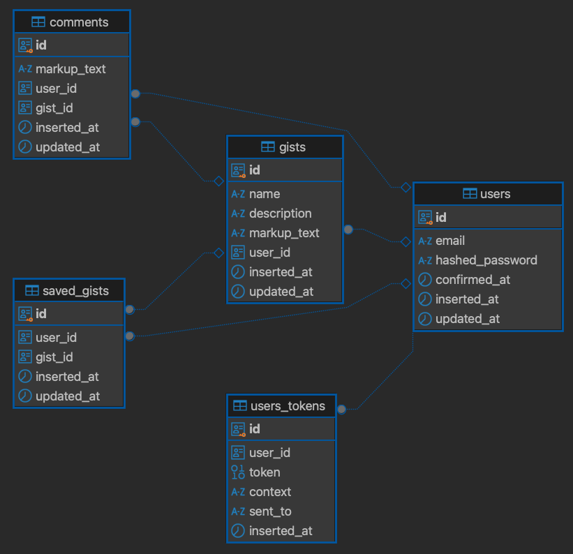

# Elixir Gist
This project is GitHub Gist clone. It focuses only on the public gists. \
Based on this [Elixir Mentor's youtube tutorial playlist](https://www.youtube.com/watch?v=OMKugMwRrko&list=PL2Rv8vpZJz4x1Svv79WdT0Da42kWt_hQ0&index=2).

## Requirements
Install elixir. I recommend installing using [asdf](https://asdf-vm.com/)
```bash
asdf plugin add erlang
asdf plugin add elixir
asdf install
```

## Database schema 


## Setting up the application
### 1. Start the database
```bash
docker compose up -d
```

To start your Phoenix server:

  * Run `mix setup` to install and setup dependencies
  * Start Phoenix endpoint with `mix phx.server` or inside IEx with `iex -S mix phx.server`

Now you can visit [`localhost:4000`](http://localhost:4000) from your browser.

Ready to run in production? Please [check our deployment guides](https://hexdocs.pm/phoenix/deployment.html).

## Learn more

  * Official website: https://www.phoenixframework.org/
  * Guides: https://hexdocs.pm/phoenix/overview.html
  * Docs: https://hexdocs.pm/phoenix
  * Forum: https://elixirforum.com/c/phoenix-forum
  * Source: https://github.com/phoenixframework/phoenix
